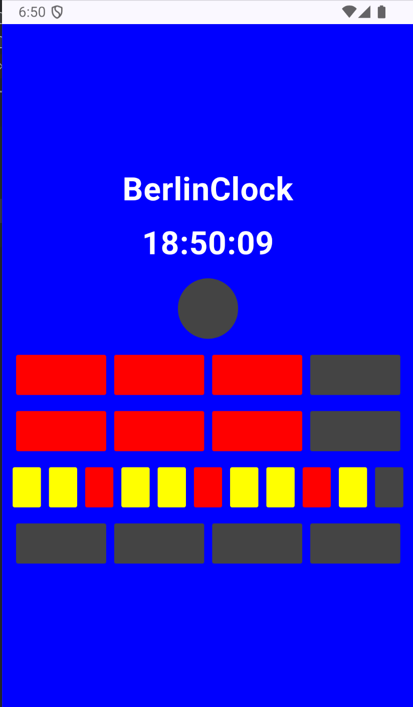

<!DOCTYPE html>
<html lang="en">
<head>
  <meta charset="UTF-8">
  <title>Berlin Clock</title>
</head>
<body>

  <h1> Berlin Clock</h1>

  <h2> Project Overview</h2>
  

    This project is a <strong>Berlin Clock</strong> built with <strong>Kotlin, Jetpack Compose, and Hilt DI</strong>.
    It demonstrates <strong>clean architecture principles</strong>, <strong>test-driven development (TDD)</strong>, and <strong>state-driven UI</strong>.
  

<h2>🖼️ Screenshots</h2>
  
Sample screens from the game:

  
  <video width="560" height="315" controls> <source src="doc/video/screenrecording.mov" type="video/quicktime"> Your browser does not support the video tag. </video>
  <h2> Clock Rules</h2>
  <ul>
    <li>The <strong>top lamp</strong> blinks to show seconds (on for even seconds, off for odd seconds).</li>
    <li>The next two rows represent <strong>hours</strong>:
      <ul>
        <li>Upper row: 4 red lamps, each representing 5-hour blocks.</li>
        <li>Lower row: 4 red lamps, each representing 1-hour blocks.</li>
      </ul>
    </li>
    <li>The final two rows represent <strong>minutes</strong>:
      <ul>
        <li>Upper row: 11 lamps, each representing 5-minute blocks. Every third lamp is red, the rest are yellow.</li>
        <li>Lower row: 4 yellow lamps, each representing 1-minute blocks.</li>
      </ul>
    </li>
  </ul>

  <h2> How to Clone &amp; Run</h2>
  <pre>
# Clone the repository
git clone https://github.com/2026-DEV2-046/BerlinClockTask.git
cd BerlinClockTask
./gradlew build
./gradlew test
./gradlew connectedAndroidTest
  </pre>

<h2>Tech Stack</h2>
  <ul>
    <li><strong>Language</strong>: Kotlin</li>
    <li><strong>UI</strong>: Jetpack Compose</li>
    <li><strong>DI</strong>: Hilt</li>
    <li><strong>Architecture</strong>: Clean Architecture + MVVM</li>
    <li><strong>State Management</strong>: StateFlow <code>BerlinClockUiState</code></li>
    <li><strong>Testing</strong>: JUnit + AndroidX Compose UI Test</li>
  </ul>

<h2>TDD Test Coverage</h2>
  <ul>
    <li>Unit Tests: Row generation logic (seconds, hours, minutes).</li>
    <li>ViewModel state emissions.</li>
    <li>UI Tests: Compose rendering of lamps, time updates.</li>
  </ul>

</body>
</html>
